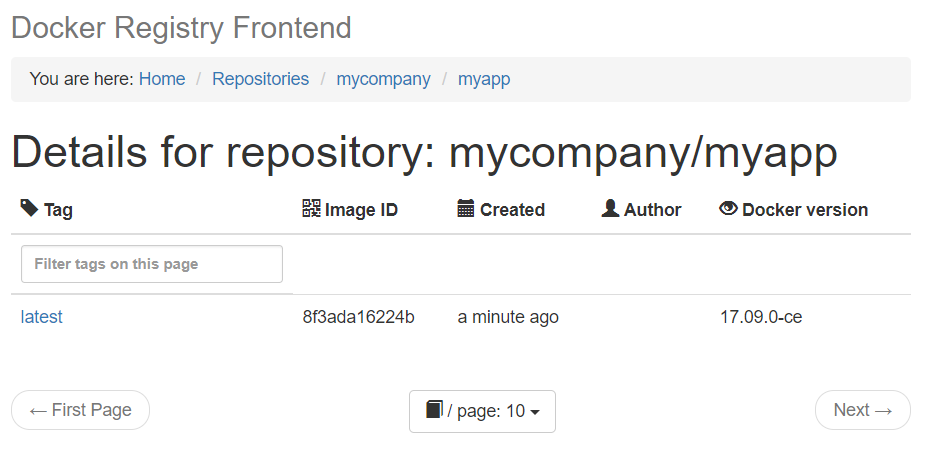

@title[Introduction]
## Offline <span style="color: #e49436">Docker</span>

#### How to use docker for (almost) continuous delivery to an offline environment.*
<br>
<br>
<span style="color: #bbb; font-size: 80%">[ Docker, Compose, Linux, Windows ]</span>

---

#### No more <span style="color: gray">"We target Windows, so we can't use Docker."</span>
#### No more <span style="color: gray">"We are on private networks, so no benefit from Docker."</span>
<br>
#### Just <span style="color: #e49436">docker-compose build</span>.
#### Then <span style="color: #e49436">docker-compose push</span>.

---

@title[Step 1. Build & Push]

### <span style="color: #e49436">STEP 1. Build & Push</span>
<br>

```shell
docker-compose up -d registry ui
docker-compose build
docker-compose push
```

@[1](Start local Docker registry (on `:5000`, Web UI at [:8080](http://localhost:8080)))
@[2](Build Docker images (tag to `localhost:5000`))
@[3](Push images to registry)

---

Registry frontend on [:8080](http://localhost:8080)



---
@title[Step 2. Export]

### <span style="color: #e49436">STEP 2. Export</span>
<br>

```shell
docker-compose run export
```

@[1](Export volume `docker_images -> ./data/registry.bz2`.)

---
@title[Step 3. Ship It!]

### <span style="color: #e49436">STEP 3. Ship It!*</span>
<br>


<span style="color: #bbb; font-size: 80%">*Not our business here.</span>

---
@title[Step 4. Import & Run]

### <span style="color: #e49436">STEP 4. Import & Run</span>
<br>

```shell
docker-compose run import
docker-compose up -d registry ui
docker run [registry:5000]/mycompany/myapp:latest
```

@[1](Import volume `./data/registry.bz2 -> docker_images`.)
@[2](Start registry.)
@[3](Run one of your images.)

---

### View The <a target="_blank" href="https://github.com/awesome-inc/docker-deploy-offline">Code</a>
